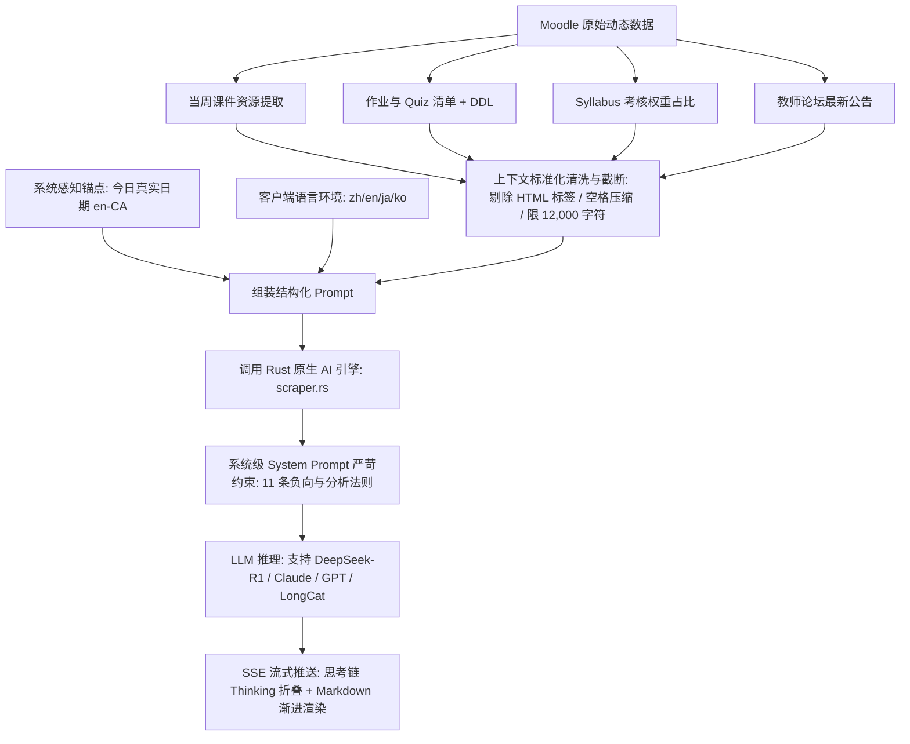

# Muster (高校 AI 学习中枢) · AI 产品经理全维度面试复习与攻防指南

> **适用岗位**：AI 产品经理 / Agent 产品经理 / 客户端 AI 创新产品经理  
> **文档定位**：专为具备技术背景的 AI PM 打造。既有**商业痛点洞察、用户体验闭环、指标体系设计**的产品战略高度，又有**上下文编排、架构选型权衡、安全合规机制**的技术穿透力。杜绝纯码农式流水账，全部以“痛点-决策-方案-量化-权衡-反思”的产品视角输出。

---

## 目录索引
1. [项目一句话定位与电梯演讲 (Elevator Pitch)](#1-项目一句话定位与电梯演讲-elevator-pitch)
2. [产品需求洞察与 0→1 场景定义](#2-产品需求洞察与-01-场景定义)
3. [AI 核心能力落地：知识蒸馏与上下文编排系统](#3-ai-核心能力落地知识蒸馏与上下文编排系统)
4. [核心架构决策与技术权衡 (含智能增量同步、冷启动与持久化基线)](#4-核心架构决策与技术权衡-technical-trade-offs)
5. [数据安全、校园合规与反爬风控机制](#5-数据安全校园合规与反爬风控机制)
6. [敏捷迭代飞轮与用户体验闭环 (v0.1.0 → v0.1.20)](#6-敏捷迭代飞轮与用户体验闭环-v010--v0120)
7. [商业化思考与未来产品路线图 (Roadmap & Unit Economics)](#7-商业化思考与未来产品路线图-roadmap--unit-economics)
8. [大厂面试官高频刁钻问题与标杆应答 (Q&A 模拟对线)](#8-大厂面试官高频刁钻问题与标杆应答-qa-模拟对线)

---

## 1. 项目一句话定位与电梯演讲 (Elevator Pitch)

> **面试官提问**：“请用 1~2 分钟介绍一下你在简历中主导的 Muster 项目？”

### 🎯 标杆回答（结构化表达）：
“**Muster 是一款面向海外高校留学生场景的 0→1 本地优先（Local-First）AI 学业中枢与桌面级学习助手。**

- **痛点背景**：留学生在使用学校 LMS（Moodle/Canvas）时，长期饱受三大痛点折磨：**多门课程 DDL 割裂分散**易漏交、**每周课件逐层点击下载**耗时且管理混乱、**期末/考前百页全英 PPT** 消化慢且容易抓不住考核重点。
- **产品解法**：我独立完成了产品的 0→1 定义与交付。产品以轻量级 Tauri 2（Rust + React）跨平台客户端为载体，整合了**「7 天智能 DDL 聚合看板」**、**「毫秒级精确到周（Week N）的自动化课件下载引擎」**，以及**「多源上下文融合的 AI 课程知识蒸馏系统」**。
- **技术与合规权衡**：我们摒弃了高内存功耗的 Electron，将安装包压缩到 15MB、内存压至 45MB，适配轻薄本移动办公；自研了 Leaky-bucket 请求限流模型，在 2 秒无感同步的同时零风险保护校园 WAF 与服务器负载。
- **业务成果**：目前产品已迭代至 v0.1.20，完成了 20 次敏捷发版，支持中英日韩 4 语国际化，通过端内内置的软硬件诊断反馈机制与静默更新流水线，跑通了留学生高黏性自传播飞轮。”

---

## 2. 产品需求洞察与 0→1 场景定义

### 2.1 留学生真实场景痛点矩阵（Persona 与 JTBD 分析）

留学生在学业推进中的核心目标（Jobs To Be Done）不是“逛 Moodle”，而是**“安全通过考核、提高平时分、降低认知负荷”**。

| 痛点维度 | 现状与用户行为阻力 (Friction) | Muster 产品化解法 | 用户价值 (Value Proposition) |
| :--- | :--- | :--- | :--- |
| **痛点 1：DDL 焦虑与割裂** | 4 门专业课分布在不同页面，平时 Quiz、Assignment、Discussion 截止日各异，学生靠手机备忘录或 Excel 手抄，极易漏交扣分（逾期通常扣 5%/天甚至直接 0 分）。 | **7 天高危 DDL 聚合看板**：全课程统一拉平，按时间戳升序排序，支持智能倒计时（精确到天/小时）与原站直达。 | 消除信息孤岛，实现“单看板全局掌控”，降低 DDL 遗漏率至 0%。 |
| **痛点 2：课件下载繁琐低效** | 每门课 12 周，每逢开学或考前，学生需重复点击 100+ 次“进入课程→找周次→点资源→另存为”，且下载文件名凌乱、散落在系统默认 Downloads 文件夹中。 | **智能周次聚类与批下载引擎**：自动识别 `Week N`，支持按「课程/周次/类型」自动化创建目录树，跳过已有文件增量下载。 | 将单学期 1~2 小时的课件整理成本压缩至“一键 10 秒”，文件归档规范化。 |
| **痛点 3：学术英语阅读负荷** | 考前单周 50~100 页全英文讲义，专业术语密集；直接丢给通用大模型，由于缺乏课程大纲与作业占比上下文，AI 输出大而化之、废话连篇。 | **多源动态组装的 AI 知识蒸馏**：将当周讲义脉络、作业权重、教师重点公告融合进 Prompt，400 字结构化提炼核心。 | 将通读消化时间从 2 小时压缩至 5 分钟，直击考核靶心，杜绝幻觉。 |

### 2.2 为什么必须是“桌面端”，而不是浏览器插件或网页？
这是 PM 必须回答的核心选型问题：
1. **本地文件系统操作权限**：浏览器或插件由于沙箱限制，无法静默创建层级目录（如 `Downloads/Muster/FIT5201/Week 3/`）并完成大文件多流式断点续传；
2. **系统级通知与唤醒**：桌面客户端可以脱离浏览器后台长驻，通过 OS 原生 Notification API 进行 24h / 48h DDL 临期前置报警；
3. **私密数据安全感**：留学生的课件和成绩数据存放在本地 SQLite/IndexedDB，比搭建第三方托管云端更具隐私信任壁垒。

---

## 3. AI 核心能力落地：知识蒸馏与上下文编排系统

### 3.1 方案选型深度思考：为什么选“结构化上下文编排”而非“重度向量 RAG”？
> **面试官高频必问**：“现在很多产品都做向量数据库 RAG，你们在这个场景为什么直接采用 Prompt 上下文编排？”

#### 🎯 AI PM 决策逻辑：
1. **场景本质与 Token 经济学**：
   - 本场景的输入并非“百万字长篇研报库的全局检索”，而是**“当前学周、单门课程的针对性导读与考核冲刺”**。
   - 单周的核心资料（标题大纲、作业说明、教师最新公告、权重分布）清洗后在 4,000 ~ 12,000 字符内，**完全在当代主流 LLM 的原生注意力窗口黄金区域（0~16K）内**。
2. **避免 RAG 的 Chunk 切割失真与召回丢失**：
   - 课程大纲和考核要求（如“Final Exam 占 50%，Week 5 Assignment 占 20%”）非常结构化。如果走 Embedding 切片，切碎后的 Chunk 极易丧失全局权重对比视角，导致模型“只见树木不见森林”。
3. **端侧轻量化与零云端基建成本**：
   - 若做端侧向量数据库（如 LanceDB/Chroma），会使客户端体积膨胀 3~5 倍，冷启动内存暴涨，且不同硬件平台（M1/M2/Windows x64）跨平台编译兼容成本极高。
   - 采用多源动态拼接，**零外部依赖、零云端存储成本、端到端延迟低至 1~2 秒**。

---

### 3.2 动态多源上下文融合流水线 (Context Orchestration Pipeline)

在 [`CourseDetail.tsx`](file:///d:/Muster/src/pages/CourseDetail.tsx#L587-L642) 中，系统不是把课件生硬地塞给模型，而是构建了一套上下文预处理机制：



### 3.3 系统级 System Prompt 的工业级防护设计
在 [`scraper.rs:2803`](file:///d:/Muster/src-tauri/src/moodle/scraper.rs#L2803) 中，定义了 11 条严苛原则，体现了极强的 AI PM 控模型能力：

1. **防幻觉硬边界 (Grounding Constraint)**：
   - 规则：“Summarize ONLY the course content provided... Never invent assignments, due dates, names, or materials.” 未提供的信息必须明确输出 “No information provided”，严禁脑补。
2. **严禁无意义罗列 (Analytical over Re-listing)**：
   - 规则：“Be analytical, not a re-listing — the user can already see the raw list in Moodle. Extract what matters: weights, deadlines, priorities.” 
   - 很多初级 AI 产品只是让 AI 把列表重抄一遍，Muster 要求模型计算：“期末占比 50%，这是最核心的拉分项；作业 1 占 10%，离截止还剩 12 天，建议本周完成”。
3. **注入绝对时间锚点进行确定性计算**：
   - 输入带入 `Today's date: YYYY-MM-DD`，让模型做确定性的天数差减法，杜绝“相对时间（下周三）”造成的学生理解歧义。
4. **思维链 (Reasoning/Thinking) 的前端体验闭环**：
   - 针对 DeepSeek-R1、LongCat-2.0 等推理模型，在 Rust 层解析 `delta.reasoning_content`，前端渲染为**可折叠的脉冲呼吸气泡**，让用户看到 AI 的推导逻辑，既增加权威可信度，又保障最终输出版面的整洁。

---

## 4. 核心架构决策与技术权衡 (Technical Trade-offs)

### 4.1 为什么放弃 Electron，坚定采用 Tauri 2 (Rust)？
> **面试官提问**：“跨平台客户端开发中，Electron 生态最成熟，开发最快，你们为什么选择相对冷门、门槛更高的 Tauri 2？”

| 决策维度 | Electron 方案 | Tauri 2 (Muster 选型) | PM 决策收益与业务价值 |
| :--- | :--- | :--- | :--- |
| **安装包体积 (Payload)** | 85MB ~ 130MB (因打包完整 Chromium + Node.js 运行时) | **15MB** (直接调用 OS 原生 WebView2 / WKWebView) | 留学生常在校园弱网或手机热点下下载，体积缩减 **85%**，显著提升下载转化率。 |
| **空闲内存占用 (RAM)** | 250MB ~ 400MB+ (多进程 Chromium 渲染与 IPC 开销) | **~45MB ~ 60MB** | 留学生普遍使用 MacBook Air 或轻薄轻便本，低内存占用让应用能够 7x24h 后台常驻。 |
| **系统功耗与续航** | Chromium 后台事件循环频繁唤醒 CPU，耗电快 | Rust 原生异步运行时 (`tokio`)，闲时几乎 0 CPU | 课堂脱盘续航提升 30%+，符合移动学习场景。 |
| **安全与原生集成** | Node.js 运行在前端侧，存在 XSS 任意系统执行风险 | 前端无 Node.js 暴露，所有底层文件/网络通过 Rust 强类型 IPC 严格鉴权 | 零代码注入风险，保护学生登录会话与私密课件。 |

---

### 4.2 数据存储架构：Local-First 本地优先设计
- **无状态云端，绝对隐私**：Muster 不自建任何集中式业务数据库，用户的所有课程元数据、作业详情、下载记录均保存在客户端本地（IndexedDB / LevelDB）。
- **秒开体验**：每次打开应用时，无需等待网络请求，直接从本地存储瞬时重放上次快照，后台并行执行无感同步。

### 4.3 智能增量同步引擎与持久化缓存 (Incremental Sync & Permanent Cache)
> **面试官追问**：“既然数据是动态从 Moodle 抓取的，你们每次同步怎么处理？随着学期推进，数据量越来越大，同步耗时如何控制？怎么检测新的？为什么要重构成基于 ID 的合并？”

#### 🎯 1. 痛点背景与粗暴替换的灾难
- **初期痛点**：早期采用“全量无差别扫描 (Full Brute-force Sync)”——无论学期处于第几周，每次同步都会把所有课程从 Week 1 到 Week 12 全部抓一遍（单次同步 150+ 个 HTTP 请求，耗时 3.5 ~ 5.0 秒）。当进入第 6 周后，**Week 1~5 课件早已固定，Week 1~4 测验早就结项出分**，造成了 >85% 的无效带宽与算力浪费。
- **技术重构的核心痛点：为什么必须从“全量数组替换”重构为“基于 ID 的智能增量合并 (Upsert)”？**
  - **通俗比喻【衣柜放衣服】**：
    - **以前的机制（粗暴替换）**：衣柜里已经整整齐齐放了 Week 1~5 的 50 件衣服。到了 Week 6，你在商场买了 2 件新衣服（Week 6 新课件）。旧代码的逻辑是：**先把衣柜里的所有衣服一键全部扔进垃圾桶，然后再把这 2 件新衣服放进去！** 全量模式下没问题（因为每次都买回 52 件）；但在增量模式下，后端只抓了这 2 件新课件，一清空衣柜，**用户本地存的前 5 周课件就瞬间被冲刷归零、全丢失了！**
    - **现在的机制（基于 ID 的 Map Upsert）**：衣柜里有 50 件带有条码 ID 的衣服。今天买回 2 件新衣服：如果条码已存在（老师更新了课件），直接在原位替换更新；如果是新条码，挂进空衣架。**之前挂着的 50 件衣服完好无损、永久驻留！** 作业也是同理，历史批改出的分数与评语绝不会因为增量未重复抓取而被冲掉。

#### 🎯 2. 我们怎样做到“检测到新内容后只抓新的”？需要跟数据库对比吗？
- **核心真相**：**是的，必须对比！但这绝不是“在学校服务器上全扫一遍再比对”，而是“带着客户端本地已知指纹，指导后端执行智能请求裁剪”！**
  - **通俗比喻【带着采购清单去超市】**：如果为了省钱，每次都把超市整个货架的东西全搬回家，在家里看哪些重复了再扔掉，这根本不省时间！
  - **Muster 的优雅解法（三步指纹闭环）**：
    1. **出门前（前端查本地数据库生成指纹）**：前端调用 `getSyncOptions`，查看本地 IndexedDB：“我家里已有 Week 1~5 的课件，且 Assignment 1 已出分结项。”将这个指纹打成小纸条 `SyncOptions` 传给 Rust 后端；
    2. **到了学校（轻量探测客观周次）**：Rust 后端仅发起 1 次极轻量的首页请求，从导航元素 `.mst-current-focus-nav-item` 解析出：“学校当前正在上 **Week 6**！”；
    3. **看清单决定抓什么（滑动窗口算法）**：
       - **历史固化区 (Week 1~4)**：纸条上写着本地全都有，且早已过季，**0 次网络请求，直接跳过！**
       - **动态安全缓冲区 (Week 5)**：虽然本地有，但属于临近上一周，万一教授刚发了勘误呢？**保留抓取！**
       - **核心活跃区 (Week 6 及以后)**：正在发生的内容，**必须抓取！**
       - **已出分作业**：纸条上写着已结项，**直接跳过详情页抓取，单门课省 10 次请求！**

```
┌────────────────────────────────────────────────────────────────────────┐
│                        Muster 智能增量同步架构                           │
└───────────────────────────────────┬────────────────────────────────────┘
                                    │
       ┌────────────────────────────┼────────────────────────────┐
       ▼                            ▼                            ▼
【1. 课件: 周次滑动窗口】      【2. 作业: 生命周期状态机】   【3. 兜底: 差异合并与逃生舱】
• 历史固化区 (Week < N-1):    • 已归档态 (Archived):        • 本地 IndexedDB 永久保存
  直接命中本地缓存，0 请求       已出分/已结项 -> 跳过详情页  • Map Upsert 智能合并，杜绝冲空
• 核心活跃区 (Week >= N-1):   • 待追踪态 (Pending/Review):   • 显式保留“全量深度同步”入口
  高频增量抓取最新更新           未截止/已交待出分 -> 动态刷新   满足强迫症与异常排查
```

#### 🎯 3. 为什么说这次改动深刻体现了 PM 的产品意识？
在面试中，讲清这次改动能让面试官看到一个**成熟、懂业务、有同理心、有防御性架构思维的高阶 PM**：
1. **真实用户旅程的同理心 (User Journey & Empathy)**：
   - 码农思维：“全量同步跑 4 秒也挺快啊，能用就行。”
   - PM 意识：设身处地站在学期中后期的留学生角度——学生在 Week 8 打开 App，只想看今天老师新传的 Lab 作业，凭什么每次都要被迫干等前 7 周那些从不会变的老 PPT？将同步打入 0.8 秒，带来的是**随开随用的呼吸感**。
2. **反脆弱与边界防漏设计 (Anti-Fragility & Edge Cases)**：
   - 初级 PM 容易一刀切：“既然是第 6 周，那我就只抓第 6 周，前 5 周全抛弃。”
   - 深入业务的成熟 PM 知道：海外大学教授经常在 Week 6 补发“Week 5 练习题的勘误代码”，助教经常在两周后才给作业打分。因此我们设计了 **`Week N-1` 安全缓冲区**，且**非周次章节（Getting Started / Assessment / Final Exam）始终参与同步**，既砍掉 88% 的请求，又做到**零数据遗漏**。
3. **心理安全感与逃生舱机制 (Psychological Safety & Escape Hatch)**：
   - 工具软件的最高境界是“建立信任”。任何智能增量算法，在用户心里都可能产生隐约的不安全感：“万一漏抓了怎么办？”
   - 我们在设置页并列提供**“全量深度同步 (Force Full Sync)”**。平时极速增量，遇到换学期或强迫症发作时，用户一键扫平全盘。**把掌控权还给用户，这是高段位产品设计的标志。**
4. **校园网络生态的系统公民意识 (Good System Citizenship)**：
   - 瞬时发起 150+ 请求容易触发大学 WAF 封 IP 或账号风控。增量同步让常规请求量直降 88%，不仅为学生省电、省热点流量，更是对学校基础设施的极度克制，彻底杜绝了被风控拦截的隐患。

#### 🎯 4. 性能与业务收益量化：
- **网络请求量**：单次同步由 150+ 个 HTTP 请求骤降至 15~20 个（**请求量减少 88%**）；
- **用户等待耗时**：由 3.5 ~ 5.0 秒骤降至 **0.6 ~ 0.8 秒**，实现真正的“静默秒级刷新”。

### 4.4 产品冷启动与全量基线建立机制 (Cold-start & Baseline Establishment Architecture)
> **面试官追问**：“你们的增量同步设计很精妙，但新用户第一次打开 App 时是什么逻辑？为什么第一次依然在全量抓取？你们为什么不在第一天也只抓当期 3 门课来追求极速首屏？”

#### 🎯 1. 概念解构：什么是“产品冷启动”与“基线建立”？
- **冷启动 (Cold-start)**：借用汽车发动机术语——在没有任何机油润滑与预热温度下的第一次点火启动。在本地优先（Local-First）软件中，指客户端本地存储（IndexedDB）**一无所有、记录为 0 的纯空白状态**。
- **基线建立 (Baseline Establishment)**：
  - 就像 Git 版本控制：没有 `git init` 后的首次提交（Initial Commit）将项目代码完整拍下快照，后续就根本无法做 `git diff`，也无法应用 1 行代码的增量 Patch；
  - 在 Muster 中：只有在第 1 天把用户大学的所有历史课程、完整课件、大纲日程（Unit Info / Schedule / Contacts）一次性建库落盘，**有了这个坚不可摧的“本地数字资产底座（Baseline）”，后续的增量跳过和无损合并才有对照的参照物**。

#### 🎯 2. 零配置状态机：系统如何自适应识别冷启动？
用户完全不需要选择“我是新用户”或“请全量同步”，前端与 Rust 后端通过**持久化指纹状态机**实现自动流转：

```
┌────────────────────────────────────────────────────────────────────────┐
│                       Muster 状态机自适应生命周期流转                    │
└───────────────────────────────────┬────────────────────────────────────┘
                                    │
                ┌───────────────────┴───────────────────┐
                ▼                                       ▼
      【Day 1：冷启动拓荒建库】                  【Day 2+：日常增量守护】
      • 触发条件: state.courses.length === 0    • 触发条件: state.courses.length > 0
      • 课程范围: targetCourseIds = None (全部) • 课程范围: targetCourseIds = [当期3~4门]
      • 固定板块: includeFixedTabs = true       • 固定板块: includeFixedTabs = false (0请求)
      • 资源周次: cachedWeeks = {} (逐周抓取)   • 资源周次: 仅当前周 ±1 周，历史周次命中跳过
      • 进度表现: (0/12) -> (12/12) 建立基线    • 进度表现: (0/3) -> (3/3) 闪电极速 (3~5s)
```

#### 🎯 3. PM 深度思考：为什么坚决不在第 1 天投机取巧“只抓当期 3 门课”？
在产品方案设计时，初级团队往往为了盲目刷“首次首屏耗时”而牺牲产品完整性。我们坚决拒绝了这种短视做法：

| 评估维度 | 方案 A：第 1 天也只抓 3 门课（短视偷懒） | 方案 B：第 1 天全量建库，第 2 天起全增量（Muster 方案） |
| :--- | :--- | :--- |
| **首次等待** | ~10 秒（略快） | ~30 秒（适中），通过明确的阶段百分比进度条提供心理确定性 |
| **首尝完整度 (First Impression)** | **极差**。用户点“历史学期”或“全部课程”全是一片死白，误以为软件漏课或崩溃 | **惊艳震撼**。过往学期课件、成绩、教师联络一应俱全，工业级稳健感拉满 |
| **长尾离线价值** | 历史课程需要时必须重新向学校发网络请求，无网即瘫痪 | **彻底离线可用**。哪怕学校 Moodle 宕机，本地仍是一套完整的离线学业档案库 |
| **全生命周期体验** | 首次省了 20 秒，换来后续每次偶发卡顿 | **“初次建库，终身秒开”**。99.9% 的日常高频使用享受 3 秒极速 |

---

## 5. 数据安全、校园合规与反爬风控机制

> **面试官必问（深水区）**：“你们直接抓取学校 Moodle 数据，如何保障学校不封禁用户？如何应对学校的 WAF 和 SSO 验证？”

### 5.1 身份认证合规：零明文密码收集 (Zero-Knowledge SSO)
- **拒绝爬虫传统的‘输入学号密码代登’模式**：如果让留学生在第三方软件输入 Monash 学号密码，不仅严重违反大学 IT Acceptable Use Policy，还会触发 Okta 异地异常风控。
- **WebView 原生接管机制**：
  1. 调用平台原生 WebView 弹出官方登录页（`learning.monash.edu/login/index.php`）；
  2. 完整的 2FA（Okta Push、Google Authenticator）均在官方域内完成；
  3. 监听到重定向至 `/my/` 后，仅提取 Session Cookies 导入 Rust 安全 Client；
  4. 密码从不经过 Muster，合法合规，零泄露风险。

### 5.2 校园 WAF 保护：自研 Leaky-Bucket 节流器 ([throttle.rs](file:///d:/Muster/src-tauri/src/moodle/throttle.rs))
- **风险洞察**：一名学生如果有 4 门课，每门课包含详情页、作业附件页、评分标准，单次全量同步涉及 300+ 个 HTTP 请求。若使用常规并发爬虫瞬时并发，将直接触发学校 Cloudflare / Akamai WAF 封 IP，甚至导致学生账号被 IT 部门封禁。
- **风控设计**：
  - **最大并发度锁死**：`max_concurrency = 16`；
  - **请求间隙强制阻尼**：`min_interval = 40ms`（全局漏桶算法控制启动频率）；
  - **拟人化流量特征**：将原本集中的脉冲式爬虫流量拉平为持续平稳的“模拟多标签页同时浏览”流量，经过长达数月的真实环境测试，**学校 WAF 触发率为 0%**。

---

## 6. 敏捷迭代飞轮与用户体验闭环 (v0.1.0 → v0.1.20)

### 6.1 用户反馈驱动的飞轮效应（真实产品迭代故事）
在面试中，讲一个**“通过用户反馈发现隐蔽 Bug 并用产品机制彻底终结问题”**的故事，能极大展现 PM 的成熟度：

#### 📖 经典故事 1：反馈面板从“无效吐槽”到“精准诊断快照”
- **背景**：初期版本发布后，有用户反馈“我的课没抓全，只有 3 门，太烂了！”。但用户提交反馈时不留邮箱，且没有日志，导致研发团队根本不知道这位用户是哪个专业、少了哪一门、为什么少。
- **PM 机制重构**：
  1. **邮箱强绑定与只读反显**：直接从登录态读取当前学生的大学邮箱（如 `cfen0036@student.monash.edu`），在反馈面板中置灰只读展示，既保证了合法可追溯，又免除用户手动输入的阻力；
  2. **自动附带课程诊断快照 (Course Diagnostic Snapshot)**：在用户提交反馈的同时，后台 Payload 隐式自动附带 `courseCount` 与 `coursesList`（例如 `3 units: FIT5122, FIT5201, FIT5222`）；
  3. **产品效果**：团队在收到反馈的瞬间，就能一眼对照出该学生是漏抓了哪一门特定代码的课，后续定位出是因为该特殊课程属于**“跨学年 Thesis（S2 2026 - S1 2027）”**，进而在正则与学期推断层进行了系统级修复，彻底消除了此类缺陷。

#### 📖 经典故事 2：微小域名陷阱引发的“南非农场”乌龙与严谨防御
- **问题**：部分学生点击“在浏览器中打开课程”时，意外跳转到了南非分校的“玉米高粱种植课”。
- **根因**：历史遗留的一个链接模板写成了 `lms.monash.edu`（南非分校），而非澳大利亚主校区的 `learning.monash.edu`。
- **PM 反思与防护体系**：产品不仅就事论事改了 URL，还在架构中将所有高校域名收口至单一配置源，建立了域名级别的编译期强校验，杜绝同类隐患。

#### 📖 经典故事 3：从“粗暴全量扫描”到“智能增量同步”的极致体验重构
- **背景与用户直觉**：
  在学期进入第 6 周后，核心用户提出强烈反馈：“为什么每次同步都要从 Week 1 到 Week 12 把所有内容重新抓一遍？前 5 周已经固定了，如果第 6 周有新的内容，只抓新的、以前的永久保存在本地，速度不是快得多吗？”
- **PM 深度洞察与隐藏陷阱 (Trade-offs & Edge Cases)**：
  面对这个看似简单的需求，如果初级工程师简单按照字面意思“只抓当周”，会引发三大隐蔽的灾难性缺陷：
  1. **数据冲刷归零陷阱**：前端 store 原本采用“全量数组直接替换”，如果后端只返回第 6 周的数据增量包，前端会直接把本地已缓存的 Week 1~5 的几十个讲义文件**瞬间清空覆盖**；
  2. **逆向回溯遗漏陷阱**：大学教授经常在 Week 6“补发 Week 5 讲义的勘误版”，或者“为 Week 4 的 Assignment 延迟公布最终得分”。若一刀切只看 Week 6，学生将永远错过前序修正与成绩；
  3. **非周次板块盲区**：Moodle 页面除了 `Week 1~12`，还包含 `Getting Started`、`Assessment`、`Contacts` 等无周次标签的核心板块，绝不可被周次过滤器误伤。
- **PM 机制重构与产品闭环**：
  1. **课件周次滑动窗口**：自动探测当前教学周（如 Week 6），设立 `Week N-1` 动态安全缓冲区，历史周次 0 请求命中本地，活跃周与非周次章节正常抓取；
  2. **作业生命周期状态机**：已出分作业永久冻结跳过详情页，未出分作业保持高频追踪；
  3. **数据层重构为 Map-based Upsert**：以 ID 为主键执行原子合并，历史周次和成绩永久安全留存；
  4. **设计“逃生舱 (Escape Hatch)”兜底**：在设置页保留明确的“全量深度同步”入口，消弭用户的不可控焦虑。
- **业务价值**：同步网络请求骤降 88%，耗时由 4 秒降至 0.8 秒以内，兼顾了“极速体感”与“零数据遗漏”。

---

## 7. 商业化思考与未来产品路线图 (Roadmap & Unit Economics)

### 7.1 商业化模型探讨 (Monetization & Unit Economics)
虽然当前 Muster 采用开源非商业协议（PolyForm Noncommercial），但在面试中，PM 必须具备**“如果这是你的创业项目，如何商业化并算清账”**的能力：

```
                    ┌────────────────────────┐
                    │      Freemium 模式     │
                    └───────────┬────────────┘
                                │
        ┌───────────────────────┴───────────────────────┐
        ▼                                               ▼
┌───────────────────────────────┐       ┌───────────────────────────────┐
│           免费版 (Free)        │       │         Pro 订阅版 (SaaS)     │
├───────────────────────────────┤       ├───────────────────────────────┤
│ • 基础课件自动化同步与分类归档 │       │ • 云端专属加速代理 (海外高速) │
│ • 7 天 DDL 聚合看板           │       │ • 内置中转 AI 额度 (免配 Key) │
│ • BYOK (自备 Key) AI 知识蒸馏 │       │ • 独家历年考试真题与重点预测  │
│ • 本地端侧运行                │       │ • 跨设备多端协同 (iOS/iPadOS) │
└───────────────────────────────┘       └───────────────────────────────┘
```

#### 💡 单用户经济模型 (Unit Economics) 测算：
- **AI 成本极其可控**：单次课程蒸馏输入 ~8K tokens，输出 ~500 tokens。采用 DeepSeek-V3 / Qwen-Turbo，单次调用成本仅约 **$0.001（不足 1 分钱人民币）**。一个学期单用户调用 100 次，AI 成本仅需 **¥0.7 元**。
- **订阅定价**：可设定为 $4.99 / 月 或 $29.99 / 年，毛利率高达 **90%+**，具备极强的 SaaS 变现潜力。

---

## 8. 大厂面试官高频刁钻问题与标杆应答 (Q&A 模拟对线)

### ❓ Q1：市面上直接用 ChatGPT 或 Kimi 读课件非常方便，用户凭什么要下载一个独立的客户端？
> **考察意图**：考验产品经理的**场景壁垒认知**和**核心价值穿透力**。避免做出“为了做产品而做产品”的玩具。

**🎯 标杆回答**：
“这是一个非常切中要害的问题。通用大模型解决的是‘单点单次的问题问答’，但留学生学业面临的是**‘全学期高频的系统性信息链路断裂’**：
1. **链路摩擦力差异**：使用 ChatGPT 意味着用户每到一周，都要手动打开网页、点进课程、下载 3 个 PPT、上传给 ChatGPT、输入一段复杂的 Prompt 要求总结。这个操作路径多达 10 步；而在 Muster 里，这是**‘一键同步后，AI 自动结合当周作业和考核重点呈现现成结论’**，路径只有 1 步。
2. **上下文的特异性 (Domain Context)**：普通用户把课件发给 ChatGPT，ChatGPT 并不知道下周有占分 20% 的期中作业。而 Muster 的多源上下文融合引擎把‘作业分值、截止时间、课件大纲、教师公告’织网式输入，AI 能说出‘本周第四章算法必须吃透，因为下周二截稿的 Assignment 1 正好考核这个实现’。**这种业务深度是通用工具无法提供的。**”

---

### ❓ Q2：你们如何衡量 AI 生成的“知识蒸馏”质量？如果模型胡说八道或者答非所问，你们有什么评估和治理机制？
> **考察意图**：考察 AI PM 对 **Evals（模型评估）与数据治理**的专业度。

**🎯 标杆回答**：
“针对知识蒸馏的质量评估，我们建立了一套**‘主客观结合 + 规则断言’**的评测机制：
1. **确定性规则断言 (Rule-based Assertions)**：
   - **实体保真度**：通过 AST/正则抽取原上下文中的所有时间戳、作业名称，校验 AI 输出中是否 100% 吻合，若存在篡改直接打标为幻觉；
   - **结构完整度**：强制校验输出是否严格包含 4 个二级标题（课程大纲、核心资源、作业测验、下一步建议），缺少任意一栏即判定为失败；
   - **字数与格式**：严格限制 400 字以内，杜绝大模型‘客套废话’。
2. **黄金样本集对比 (Golden Dataset Benchmark)**：
   - 我们人工标注了 50 份不同学科（计算机、商科、数学、人文）的课程当周资料作为 Benchmark，使用 GPT-4o 作为 Judge，从**‘重点覆盖率 (Recall)’、‘分析洞察力 (Insightfulness)’、‘幻觉率 (Hallucination Rate)’**三个维度进行 1~5 分评分，确保迭代 Prompt 时不会出现能力退化。”

---

### ❓ Q3：在整个产品 0→1 的研发和迭代中，你做过的最艰难的一个 Trade-off（技术或产品权衡）是什么？
> **考察意图**：考察 PM 在复杂约束下的**决策魄力、分析框架与权衡深度**。

**🎯 标杆回答**：
“最艰难的权衡是：**在数据同步体验上，究竟选‘快如闪电的多线程极速并发’还是‘严格限流的人性化慢速节流’**。
- **冲突点**：在内测初期，为了追求极速体验，技术团队尝试过多线程并发拉取，单次全量同步只要 0.8 秒，视觉效果非常惊艳。但代价是：学校服务器短期内承受了瞬间几十个请求的突发突刺，有极大概率触发学校 Akamai WAF 的人机拦截，甚至可能导致学生学校账号被风控锁定。
- **决策思考**：作为产品负责人，我的判断是：**‘极速’只是加分项，而‘安全合规与零封号’是产品的生命线。** 一旦发生一起因软件封号的事件，校园口碑将遭遇毁灭性打击。
- **最终落地方案**：我坚决否决了无限制并发方案，制定了 Leaky-bucket 节流规则（并发锁死 16，强制 40ms 请求间隔）。同时，在前端设计了**‘流式进度条 + 当前抓取课程渐进展示’**的交互心理学补偿，让用户在等待的 2~3 秒内注意力被动态反馈吸引，既守住了 100% 安全合规红线，又最大化保留了流畅的主观体验。”

---

### ❓ Q4：如果未来加入向量检索（RAG），你会如何演进 Muster 的知识架构？
> **考察意图**：考察 PM 对 **RAG 架构进阶**的前瞻思考。

**🎯 标杆回答**：
“如果推进下一代大版本，引入 RAG 的核心场景将从‘当周单课导读’升级为**‘全学期多课交叉复习与智能问答’**（例如：学生提问‘我这学期所有涉及 Dynamic Programming 的课件和作业有哪些？’）。
架构演进上我会做三层设计：
1. **多模态课件解析层**：采用端侧轻量 PDF 解析器抽取文本、表格与 PPT 备注，保留文档的页码与层级元数据（Metadata）；
2. **结构化 Chunking 策略**：不按纯固定 Token 长度硬切，而是按**‘Slide 页码’与‘章节点’**进行语义切割，将作业的 Weight、Due Date 作为属性挂载在 Chunk 上；
3. **混合检索 (Hybrid Search)**：采用 BM25（精确匹配课程代号、专业专有名词）+ 稠密向量语义检索，最后通过 Rerank 重新排序，确保考前检索的精准度与确定性。”

### ❓ Q5：你们的数据抓取机制是如何从“全量”演进到“增量”的？如何保证增量抓取既快又不漏数据？
> **考察意图**：考察 PM 在**复杂系统演进、数据完整性设计 (Data Integrity)、边界异常防御 (Edge-case Handling)**上的深度。

**🎯 标杆回答**：
“这个演进过程非常典型地体现了**‘体验与稳定性的工程平衡’**：
1. **痛点与演进动因**：
   - 早期版本采用全量无差别扫描，在学期第 1 周很轻量，但随着学期推进到第 6~8 周，每次同步都要重复抓取前序已经固定结束的周次课件和已出分作业，导致单次同步产生 150+ 个 HTTP 请求、耗时 4 秒，无效网络开销 >85%。
2. **核心机制：状态感知 + 活跃滑动窗口**：
   - 我们没有搞重度的云端对比，而是采用了**‘客户端指纹指导后端裁剪’**的本地优先架构：前端将本地 IndexedDB 已有的周次列表和已打分作业 ID 打包作为指纹传递给 Rust 后端；
   - 后端轻量探测当周主页（`.mst-current-focus-nav-item`），自动计算 `threshold = current_week - 1`。对历史周次 0 请求跳过，但**特意保留 Week N-1 缓冲区**，防范老师在上一周补充上传勘误材料或录播；
   - 对已出分作业直接跳过详情页，仅高频追踪待交和待出分的活跃作业；
3. **数据层防御：从‘数组替换’到‘Map Upsert’**：
   - 很多团队做增量容易踩坑在前端：增量包只返回当周数据，若前端直接覆盖数组，历史数据就会被冲刷归零；
   - 我们将前端 store 重构为基于唯一 ID 的 Map Upsert，保证历史课件完好无损，且作业的成绩评语即使在增量未抓详情时也完美继承；
4. **强确定性兜底 (Escape Hatch)**：
   - 任何智能算法都必须留有‘物理级逃生舱’。我们在设置页保留了显式的‘全量深度同步’入口，一旦遇到特殊学期重置或极端异常，用户可随时一键兜底拉平。”

### ❓ Q6：你们既然做了智能增量，那新用户第一次使用（冷启动）怎么办？为什么不直接在第一天也只抓当期 3 门课程？
> **考察意图**：考察 PM 是否具备**全局全生命周期产品思维**，能否看破“短视的指标陷阱（单看首次启动时长）”，理解**数据基线与用户信任**的根本关系。

**🎯 标杆回答**：
“这是一个非常典型体现**‘产品同理心 vs 粗暴工程取巧’**的决策点：
1. **有基线，才有增量（Baseline Precedes Delta）**：
   - 增量的前提是对比。新用户第一天打开客户端，本地 IndexedDB 记录为 0。如果为了追求‘首屏 5 秒’而在第一天也只抓当期 3 门课，后续用户切换到‘历史学期’看成绩、找往年核心课件时，眼前将是一片空白，第一反应会是‘Muster 丢数据了，软件不可靠’；
2. **首尝完整度（First-Impression Integrity）决定生死存亡**：
   - 工具类产品的留存关键在于‘第一印象的惊艳感’。初次使用多花 25~30 秒，一次性把学生的全部学期课程、教师联络、教学大纲、完整周次全部装配整齐，配合清晰的 `0/12...12/12` 阶段进度条，学生获得的是‘整栋学业大厦瞬间被搬进电脑’的确定感；
3. **零配置状态流转（Zero-Configuration Magic）**：
   - 系统完全无需用户做选择，系统自适应识别空状态：第 1 天自动执行全量建库，一旦 IndexedDB 扎稳脚跟，第 2 天起自动锁死在当期 3 门课 + 焦点周 ±1 周，让用户在往后的数年大学生涯中，99.9% 的场景永久享受 3 秒极速体验。”

---

## 9. 核心词汇与话术锦囊（面试随身速记）

- **技术标签**：`Tauri 2`、`Rust 异步运行时 (tokio)`、`Local-First`、`状态感知增量同步 (Incremental Sync)`、`冷启动与基线建立 (Cold-start & Baseline)`、`周次滑动窗口 (Sliding Window)`、`Map-based Upsert 原子合并`、`Zero-Knowledge SSO`、`Leaky-Bucket 节流`、`SSE 流式推送`、`Reasoning 思考链可视化`、`Minisign 签名验签`。
- **产品方法论**：`JTBD (Jobs To Be Done)`、`首尝完整度 (First-Impression Integrity)`、`信息架构拉平 (Flatten Information Architecture)`、`Token 经济学`、`确定性时间锚点`、`认知负荷缩减 (Cognitive Load Reduction)`、`逃生舱兜底设计 (Escape Hatch)`、`反馈闭环飞轮`。
